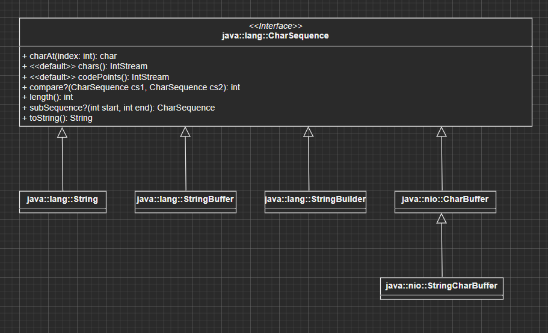

# Java for beginners - book

## Chapter 1. Java history and how it works

## Chapter 2. Imperative langauge concepts

## Chapter 3. Classes and objects

## Chapter 4. Arrays and their applications

## Chapter 5. Dealing with characters

## Chapter 6. Writing your own classes

## Chapter 7. Object-oriented relationship issues

## Chapter 8. Exceptions

## Chapter 9. Nested types

## Chapter 10. Special types of Java SE

## Chapter 11. Generics<T>

## Chapter 12. Lambda expressions and functional programming

## Chapter 13. Architecture, Design and applied OOP

## Chapter 14. Java Platform Module System

## Chapter 15. The class library

## Chapter 16. Introduction to concurrent programming

## Chapter 17. Introduction to data structures and algorithms

## Chapter 18. Introduction to graphical user interface

## Chapter 19. Introduction to files and file streams

## Chapter 20. Introduction to database management with JDBC

## Chapter 21. Bits and Bytes, Mathematics and Money

## Chapter 22. Testing with JUnit

## Chapter 23. The tools of JDK

---
---

# Chapter 1. Java history and how it works

The history of java and how the java environment works.

# Chapter 5. Dealing with characters

## Datatypes for chatacters and strings

When it comes to datatypes that we can use for characters and strings, here's a list that you can choose from:

* **```char```**: This is the primitive char data type that is well known in other programming languages as well.
* **```Character```**: This type of datatype contains a lot of static methods that can help you deal with basic ```char```s.
* **```String```**: This is a list of chars, the basic string that's met in other programming languages as well
* **```StringBuilder```**: Use this for strings that are suppossed to change. ( since basic strings are immutable )

## The ```Character``` class

The ```Character``` class is just a helper class for the primitive data type ```char```. It contains a lot of useful static methods.

### Character test methods

All the test methods have in common that they start with ```is```:

|Method|Result|
|------|------|
|```Character.isDigit('0')```|```true```|
|```Character.isDigit('-')```|```false```|
|```Character.isLetter('a')```|```true```|
|```Character.isLetter('0')```|```false```|
|```Character.isWhitespace(' ')```|```true```|
|```Character.isWhitespace('-')```|```false```|

### An overview of the most important```isXXX(...)```-Methods

* ```static boolean isDigit(char ch)```
* ```static boolean isLetter(char ch)```
* ```static boolean isLetterOrDigit(char ch)```
* ```static boolean isLowerCase(char ch)```
* ```static boolean isUpperCase(char ch)```
* ```static boolean isWhiteSpace(char ch)```

### ```toUpperCase``` and ```toLowerCase```

You can use the methods ```toUpperCase``` and ```toLowerCase``` to change the casing of a character.

* ```static char toUpperCase(char ch)```
* ```static char toLowerCase(char ch)```

### ```XXXdigit(...)``` Methods

* ```static int digit(char ch, int radix)```
    * Returns the numeric value of ```ch``` in the base ```radix```. For example ```Character.digit('f', 16)``` is 15 because F in base 16 is 15 in base 10 ( decimal ). The radix is alllowed between ```Character.MIN_RADIX(2)``` and ```Characte.MAX_RADIX(36)```. If the number can't be transformed, then you recived a -1.
* ```static char forDigit(int digit, int radix)```
    * This is the opposite of ```static int digit(char ch, int radix)```. It returns the character of the digit ```digit``` based on the given number system ( ```radix``` ). For exmpale ```Character.forDigit(6, 8)``` is 6 while ```Character.forDigit(12, 16)``` is ```c```.

## Strings

The difference between String and StringBuffer/StringBuilder is that strings are immutable. Every time you change a string, a new object is created for that string. Java, however uses the flyweight pattern so that if you have a string that looks like this: ```"abcd"```, Java will ensure that there is only one such object with that specific sequence of Character inside the whole heap. This is a very efficient design pattern. ```StringBuffer``` and ```StringBuilder```, however, are mutable objects. The other difference is thread safety:

| |Immutable|Mutable|
|-|---------|-------|
|**Thread Safe**|```String```|```StringBuffer```|
|**Not Thread Safe**|-|```StringBuilder```|

### The ```String``` class

As previously mentioned, the strings are immutable. Every time you use a method to change something to a string, a new string object is actually made, you are not really changing "the old string". Whenever you concatenate two strings together, a third string is made containing the chars from the strings that you added up together.

### The classes ```StringBuilder```/```StringBuffer```

The difference between ```StringBuilder``` and ```StringBuffer``` is that they are immutable objects. The difference between ```StringBuilder``` and ```StringBuffer``` is that ```StringBuffer``` is protected from threaded operations, while ```StringBuilder``` isn't.

### The base class ```CharSequence```

The class ```CharSequence``` is the base class for the classes ```String```, ```StringBuilder``` and ```StringBuffer```.

For example, we can look at the method ```contains(CharSequence s)``` from the class String. The parameter ```s``` can be of type ```String```, ```StringBuilder``` or ```StringBuffer```. This is useful since we don't have to be bound to one single type.

### Basic string methods

|Method|Description|
|------|-----------|
|```isEmpty()``` or ```isBlank()```|This methods test if a string is empty or not. The difference between them is that ```isBlank()``` testes if a string only contains out of whitespace.|
|```charAt(int index)```|You can use this method to get the char at a specific index|
|```indexOf(String/char i, int fromIndex)```|This method returns the index of a specific character at a specific index. You can use ```fromIndex``` to specify a start index.|
|```lastIndexOf(...)```|This is the exact opposite of ```indexOf(...)```, it returns the last index of a given string/char.|
|```equals(...)```|This method returns true if the strings are perfectly the same|
|```equalsIgnoreCase(...)```|This method returns true if the strings are perfectly the same|This method returns true if the given strings are the same, while ignoring the casing|
|```startsWith(...)``` or ```endsWith(...)```|You can test if a string starts with or ends with a certain char/string using this two methods.|
|```compareTo(...)``` or ```compareToIgnoreCase(...)```|You can use this method to compare two strings. The return values are not boolean values, they are integers. These methods compare how much a string is lexically smaller/bigger than another string. If you use the ```compareToIgnoreCase(...)``` version, the casing of the characters will be ignore.|
|```regionMatches(boolean ignoreCase, int toffset, String other, int offset, int len)```|This method compares if two regions of two strings match. Returns a boolean|
|```substring(...)```|This method returns a substring from a string based on the given startindex and optional end index ( the index index defaults to the lenght of the string )|
|```substringBefore(String string, String delimiter)``` and ```substringAfter(String string, String delimiter)```|It's like splitting a string but instead, you get the string that remains before/after the given delimiter. Example: ```substringBefore("index.html", ".")``` is "index" and ```substringAfter("index.html", ".")``` is "html".
|```getChars(int srcBegin, int srcEnd, char[] dst, int dstBegin)```|Copies chars from a string into the given source|
|```toCharArray()```|Converts the string into an array of chars|
|```concat(CharSequence s)```|Use this method to add a new string to yours. This method is actually creating a new internal char array and is adding all the chars from both strings and returns a new string as a result.|
|```join(CharSequence delimiter, CharSequence... elements/Iterable<? extends CharSequence> elements)```|This method works just like in any other programming language. It gets a sequence of elements and it puts them all together using the given delimiter.|
|```trim()```, ```strip()```, ```stripLeading()```, ```stripTrailing()```| The ```trim()``` and ```strip()``` methods both remove the whitespace from the start and from the end of a string. The difference between these two methods is that ```strip()``` is the "Unicode-Aware" evolution of ```trim()```. The method ```stripLeading()``` only removes the whitespace from the start of the string while ```stripTralining()``` remove the whitespace from the end of a string.|
|```replace(CharSequence target, CharSequence replacement)```| This method replaces all the substrings from the given ```target``` parameter with the ```replacement``` parameter > Replaces each substring of this string that matches the literal target sequence with the specified literal replacement sequence.|
|```replaceAll(String regex, String replacement)```|Replaces each substring of this string that matches the given regular expression with the given replacement.|
|```replaceFirst(String regex, String replacement)```|Replaces the first substring of this string that matches the given regular expression with the given replacement.|

### ```String``` constant pool

As previously mentioned, strings are immutable. That means that every time you create a string and change something to it, the methods that you use to change it aren't actually "changing" the string since it's immutalbe. What these methods actually do is, they are creating a new string and returning it to you.

Java uses the flyweight pattern so you don't have multiple strings in the memory that have the same contents. A string with certain contents only exists once.

> The String constant pool is a special memory area. When we declare a String literal, the JVM creates the object in the pool and stores its reference on the stack. Before creating each String object in memory, the JVM performs some steps to decrease the memory overhead.
> The String constant pool uses a Hashmap in its implementation. Each bucket of the Hashmap contains a list of Strings with the same hash code.

## Immutable strings with ```StringBuilder``` and ```StringBuffer```

We've learned that strings are immutable. This doesn't apply to ```StringBuilder``` and ```StringBuffer```. If you are making a change to a ```StringBuilder```/```StringBuffer``` object, you are actually changing the object itself and not building a new string inside the memory with new contents that is given back to you by the used method. The methods used with ```String``` objects are the same or very similar to the methods that we use with ```StringBuilder```/```StringBuffer```.

All the methods that you can use with ```StringBuilder``` you can also use the with ```StringBuffer```. From now on I'll just talk about ```StringBuilder```.

### Adding something to ```StringBuilder```

In order to add something to a ```StringBuilder``` you hav eto use the ```append``` method.

You should never use a plus ( ```+```  ) inside an ```append()``` method since that's counter-productive.

Bad:

```Java
sb.append("," + value)
```

Good:

```Java
sb.append(",").append(value);
```

### Basic ```StringBuilder``` methods

|Method|Description|
|------|-----------|
|```void setCharAt(int index, char ch)```|This method sets changes a char with the given char ```ch``` at the given index.|
|```insert(...)```|You can insert different types of data-types inside this string.|
|```delete(int start, int end)```|Deletes the substring from the given start to the given end > Removes the characters in a substring of this sequence.|
|```deleteCharAt(int index)```|Removes a char at the specified index|
|```replace(int start, int end, String str)```|Deletes the substring between ```start``` and ```end``` and adds the given String|
|```reverse()```|Returns the reversed string|

### The length and the capacity of a ```StringBuilder```

Just like strings, ```StringBuilder``` objects have the ```length()``` method that gives you the number of chars in the String. In addition to that, ```StringBuilder``` objects also have an internal buffer and you can get its length using ```capacity()```. This buffer, which actually is just a char array, is used to store all the changes that you might make to the ```StringBuilder```. The capacity is the amount of storage available for newly inserted characters, beyond which an allocation will occur. The capacity can be equal or bigger than the length of the ```StringBuilder``` object. When the capacity is too small and we need to increase it, we change the internal buffer with a new char array. You can decrease the size of the internal buffer using ```trimToSize()```. It's better however to give the capacity of the ```StringBuilder``` when you initialize it since replacing the internal buffer with a new char array can be inefficient.

You can change the length of a ```StringBuilder``` object using the ```setLength(int)``` method. If the given size is smaller than the current length then the String will just be cut to the given size.

With the method ```ensureCapacity(int minimumCapacity)``` you can ensure that the size of the internal buffer remains at a minimum capacity.

## The base type CharSequence



* ```char charAt(int index)```
    * Returns the char at the specified index
* ```int length()```
    * Returns the length of the char sequence
* ```CharSequence subSequence(int start, int end)```
    * Returns the sub sequence between the specified ```start``` and ```end```
* ```toString()```
    * Returns the whole char sequence as a string


## Converting between primitive types and strings

In order to get the string representation of an object you can use ```String.valueOf()```.
This is how this method is implemented internally:

```Java
public static String valueOf(Object obj){
    return (obj == null) ? "null" : obj.toString();
}
```

Use this methods to parse a string in different data types:

|Class|Method|
|-----|------|
|```java.lang.Boolean```|```parseBoolean(String s)```|
|```java.lang.Byte```|```parseByte(String s)```|
|```java.lang.Short```|```parseShort(String s)```|
|```java.lang.Integer```|```parseInteger(String s)```|
|```java.lang.Long```|```parseLong(String s)```|
|```java.lang.Double```|```parseDouble(String s)```|
|```java.lang.Float```|```parseFloat(String s)```|

For ```Integer``` and ```Long``` data types you can use the following methods to convert the numbers to a certain base inside the string:

* ```static String toBinaryString(int i)```
* ```static String toOctalString(int i)```
* ```static String toHexString(int i)```
* ```static String toString(int i, int radix)```
    * Convert the given integer ```i``` into a string using the base ```radix```

## Putting strings together

* You can use the plus-operator to put strings together
* You can use the ```.concat(String)``` method
* The classes ```StringBuilder``` and ```StringBuffer``` work directly with append.

### Using the ```StringJoiner``` to put strings together

The class ```StringJoiner``` helps you concatenate strings together and use a separator.

Example:

```Java
StringJoiner sj = new StringJoiner(", ");
sj.add("1").add("2").add("3");
System.out.println(sj.ToString()); // 1, 2, 3
```

In this example we added strings together using the ```.add(...)``` method.
You can use ```merge(StringJoiner)``` to append the content from another ```StringJoiner```.

### Infix, Prefix and Suffix

Besides the option of giving a separator between the strings, you also have the additional option of adding a prefix and a suffix to the ```StringJoiner```:

```Java
StringJoiner sj = new StringJoiner(", ", "{", "}");
```

### All constructors and methods

|Method/Constructor|Description|
|------------------|-----------|
|```StringJoiner(CharSequence delimiter)```|Constructs a StringJoiner with no characters in it, with no prefix or suffix, and a copy of the supplied delimiter.|
|```StringJoiner(CharSequence delimiter, CharSequence prefix, CharSequence suffix)```|Constructs a StringJoiner with no characters in it using copies of the supplied prefix, delimiter and suffix.|
|```StringJoiner add(CharSequence newElement)```|This method adds the given ```CharSequence``` to the contents of the ```StringJoiner```|
|```StringJoiner merge(StringJoiner other)```|Adds the contents of the given StringJoiner without prefix and suffix as the next element if it is non-empty.|
|```StringJoiner setEmptyValue(CharSequence emptyValue)```|Sets the sequence of characters to be used when determining the string representation of this StringJoiner and no elements have been added yet, that is, when it is empty.|
|```int length()```|Returns the length of the String representation of this StringJoiner.|
|```String toString()```|Returns the current value, consisting of the prefix, the values added so far separated by the delimiter, and the suffix, unless no elements have been added in which case, the prefix + suffix or the emptyValue characters are returned|

## Splitting strings

A toketoken is a part of a string that certain separators separate from other tokens.

|Method|Description|
|------|-----------|
|```split(...)``` from ```String```|Splits the string using a delimiter|
|```lines(...)``` from ```String```|Retruns a ```Stream<String>```|
|```Scanner```|Can read input (also line by line)|
|```StringTokenizer```|The string tokenizer class allows an application to break a string into tokens. This is from Java 1.0|
|```BreakIterator```|The BreakIterator class implements methods for finding the location of boundaries in text. Instances of BreakIterator maintain a current position and scan over text returning the index of characters where boundaries occur. Internally, BreakIterator scans text using a CharacterIterator, and is thus able to scan text held by any object implementing that protocol.|


### The ```Scanner``` class

You can use the ```Scanner``` class to read files line by line or to split a string in tokens. A ```Scanner``` is more flexible than a ```StringTokenizer```.

Example of reading a file line by line:

```Java
import java.io.IOException;
import java.nio.charset.StandardCharsets;
import java.nio.file.Paths;
import java.util.Scanner;

public class PrintAllLines {
    public static void main(String[] args) throws IOException {
        try(Scanner scanner = new Scanner(Paths.get("test.txt"), StandardCharsets.ISO_8859_1.name())){
            while(scanner.hasNextLine()){
                System.out.println(scanner.nextLine());
            }
        }
    }
}
```

## Formatting strings

In order to format strings you have to know the following format specifiers that point to certain data types:

|Specifier|Description|
|---------|-----------|
|```%n```|new line|
|```%%```|percentage|
|```%c```|Unicode character|
|```%x```|Hexadecimal value|
|```%f```|Float value|
|```%b```|Boolean value|
|```%s```|String value|
|```%d```|Decimal number|
|```%t```|Date and Time|